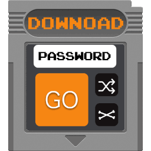

# Password machine 

 

#### A random words pass generator

## What is it?

It's a password generator, based somewhat on principles of xkcd password strength comic

The original comic can be found [here](https://xkcd.com/936/)

Password Machine generates passwords, usernames, and two word combos, that _may or may not_ [mean something](https://www.sciencedirect.com/science/article/abs/pii/S0010945208001391).

This was a personal project, later filled with features requested by a close person. In my view this is by far the best password generator I have personally seen. Why? Because once in a while we are forced to enter the passwords manually, despite our password managers placing them into the clipboard, and when this starts, I get extremely annoyed to constantly shift attention between my password manager and the input field, grabbing only couple of random alphanumeric characters at a time. Here once or two views is sufficient to retype a 40 charachter long string. All this without sacrifising the safety.

## So, `2fC*H)(y"qhB2]n:` was a stupid idea then?

Not necessarily. With all due respect to xkcd, but he's got his math wrong. [This](https://weberblog.net/password-strengthentropy-characters-vs-words/) article is talking in details on how random characters is not the same as the random word -- in short, you can fit only so many words into a string of specific length, and the redundancy (English language holds someting like 40% -- see Shannon) will play against entropy. This does not mean, however, that you should go back to gibberish -- just make your strings longer. My standard password is 40 characters long, and it usually includes only one numeral and one special character.

> You should not generate your passphrases yourself nor should you choose “easy” passphrases out of randomly generated ones!

— [Weber, _Password Strength/Entropy: Characters vs. Words_](https://weberblog.net/password-strengthentropy-characters-vs-words/)

I would advise against using these type of passwords for the strings shorter than 10 characters, or for critical items.

### So, I need a password manager then?

It's 2020 and anyone who is not making a full use of password manager right now may as well post their SSN and credit card number on 4chan. Of course you need a password manager, but you also can't reuse the passwords. This is why you need a password generator. Making the passwords yourself will only make you repeat the same guessable strings of data.

Of course password managers offer password generators, but I personally find them pretty dumb and often uncomfortable to use, especially when the password needs to be copied manually. It's amazing how often this is necessary.

## Real words wut?

The app uses three dictionaries:

_the dictionaries have been updated to the massive compilation by Ashley Bovan_

**Adjectives**: 28'000
~~is a 1347 words long list of English language adjectives. Taken from [hugsy](https://gist.github.com/hugsy/8910dc78d208e40de42deb29e62df913)~~

**Nouns**: 91'000
~~is a 1525 entries strong list of English language nouns. Taken from [The Great Noun List](http://www.desiquintans.com/nounlist)~~

**Profanities** is a 2146 entries long list of profanities, heavily edited -- I have tried as much as I could to remove prejudices and leave only insults. Many have slipped though and stayed. The list is in the state of cleaning. At any rate, I advise against using this option.

## How to use it

The app sits in the menubar and once the icon is clicked, it will generate the following data:

1. Username -- consists of a merged adjective and a noun. All spaces and punctuation are omitted. Words are capitalised and then concatenated
2. Password -- consists of capitalised words strung together, followed by one random numeral (except 0, to avoid confusion with the O) and one random special character (from a limited choice of easily accessible ones)
3. Words of Wisdom -- just a fun experiment where a random adjective and noun are juxtaposed

Password is automatically added to the clipboard once the menu is activated. Just click and use Ctr-V

All items mentioned above can be copied into the clipboard when clicked on. When click-copied, the username and / or the password will reside in "last copy-clicked" menu until replaced with the next copy-click.

The app is written in pure Go. Compiled and tested on macOS. I assume it can be compiled and run on Windows and Linux as well, but I haven't tried.

### Last copy-clicked

This menu shows you your last copy-clicked username and password (as well as indicating the time passed since the click). Can be very useful, depending on your workflow.

Username or password will be copied to clipboard when clicked. The data will stay unchanged until a new username / password respectively is clicked, or app restarts.

### Words of Wisdom

A fun juxtaposition of an adjective and noun. Can be copied into clipboard, but isn't saved anywhere.

### Settings

1. **Length** defines the length of the password
2. **Additional security** will place the number and special charachter randomly between words in the password, instead of placing them at the end. Arguably this is somewhat safer, but I personally see no huge upside.
3. **NSFW** adds a dictionary of insults and offensive words to the existing dictionary. Theoretically this strengthens the password strength by adding into the pool of predetermined words, but some of the terms truly shouldn't be there. Use at your own risk, or better don't use at all.
4. **Sailor-redneck mode** weakest, most immature mode of username and password generation -- this option removes adjectives and nouns dictionaries and leaves only profanities. Done purely for novelty purposes. Not advisable to use at all. Ever.

## What's next?

~~_Nothing_. The app in its current form has appeared as a port, and later improvement of its original Python version. I guess there will be some minor updates, but essentially the app will be rewritten in Swift or Objective-C some time soon. Go is beautiful, but it has its limitations with these type of applications.~~

Currently the app is very stable, so mostly the updates will fall in either "optimisation" or "additional features" camps.

## References

xkcd, _Password Strength_, `https://xkcd.com/936/`

FYFE, S., WILLIAMS, C., MASON, O. and PICKUP, G., 2008. _Apophenia, theory of mind and schizotypy: Perceiving meaning and intentionality in randomness._ Cortex, 44(10), pp.1316-1325. `https://www.sciencedirect.com/science/article/abs/pii/S0010945208001391`

Weber, J., 2020. _Password Strength/Entropy: Characters Vs. Words._ Weberblog.net. `https://weberblog.net/password-strengthentropy-characters-vs-words/`

hugsy, _english-adjectives.txt_`https://gist.github.com/hugsy/8910dc78d208e40de42deb29e62df913`

Desi Quintans, _The Great Noun List_, `http://www.desiquintans.com/nounlist`

Ashley Bovan, _Parts of Speech_, `http://www.ashley-bovan.co.uk/words/partsofspeech.html`

Claud E. Shannon, _The Redundancy of English_, `https*://www.uni-due.de/~bj0063/doc/shannon_redundancy.pdf`
