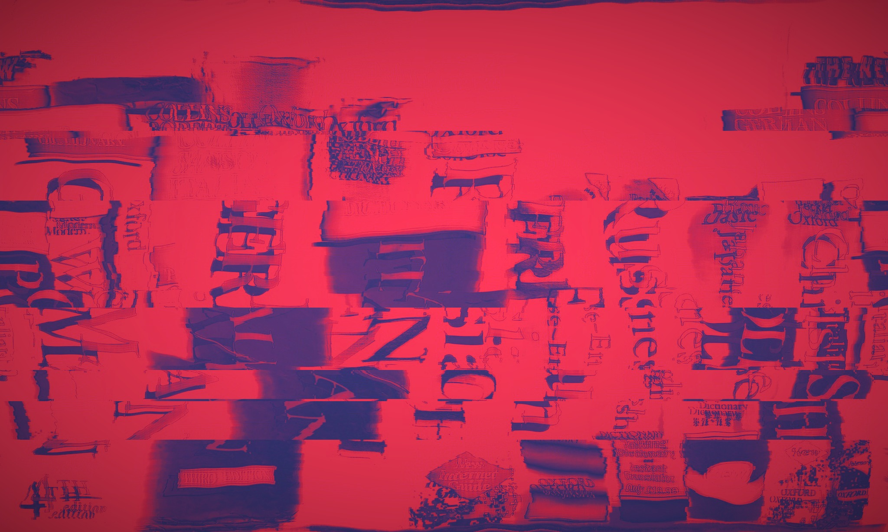

# PWgo

#### Go implementation of PW pass gen

## What is it?

PWgo is a password generator, based somewhat on principles of xkcd password strength comic

[link](https://xkcd.com/936/) to the original comic

The app sits in the menubar and upon call (by click) will generate the following data:

1. Username -- consists of a merged adjective and a noun. All spaces and punctuation are omitted. Words are capitalised and then concatenated
2. Password -- consists of 4, 6 or 8 words, one special character and one number (excluding zero, to avoid confusion). The words in the password are random, capitalized. The numeral and special character are set at the end of the password as default (can be changed in the settings)
3. Words of Wisdom -- just a fun experiment where a random adjective and noun are juxtaposed

All items mentioned above are copied into the clipboard when clicked on.

Password is automatically added to the clipboard once the menu icon is pressed.

The app is written in pure Go. Compiled and tested on macOS. I assume it can be compiled and run on Windows and Linux as well, but I haven't tried.

## How to use it?

### Last copy-clicked

This menu shows you your last copy-clicked username and password (as well as indicating the time passed since the click). Can be very useful, depending on your workflow.

Username or password will be copied to clipboard when clicked. The data will stay unchanged until a new username / password respectively is clicked, or app restarts.

### Words of Wisdom

A fun juxtaposition of an adjective and noun. Can be copied into clipboard, but isn't saved anywhere.

### Settings

1. **Length** defines the length of the password in words
2. **Additional security** will place the number and special charachter randomly between words in the password, instead of placing them at the end. Arguably this is somewhat safer, but I personally see no huge upside.
3. **NSFW** adds a dictionary of insults and offensive words. Theoretically this strengthens the password strength by adding into the pool of predetermined words, but some of the terms truly shouldn't be there. Use at your own risk, or better don't use at all.
4. **Sailor-redneck mode** weakest, most immature mode of username and password generation. Done purely for novelty purposes. Not advisable to use at all. Ever.

## What's next?

Nothing. I guess there will be some minor updates, but essentially the app will be rewritten in Swift or Objective-C some time soon. Go is beautiful, but it has its limitations with these type of apps.

As is the app is very stable, so mostly the updates will fall in either "optimisation" or "additional features" camps.
